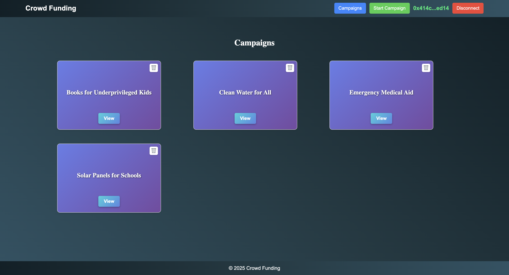
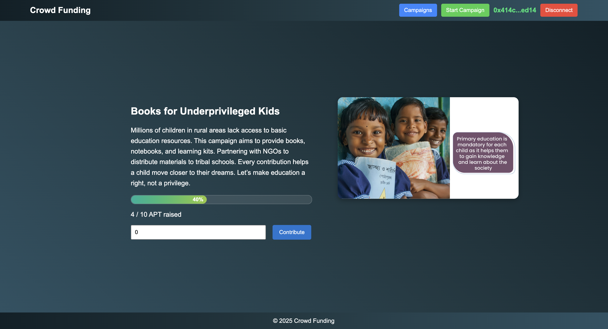
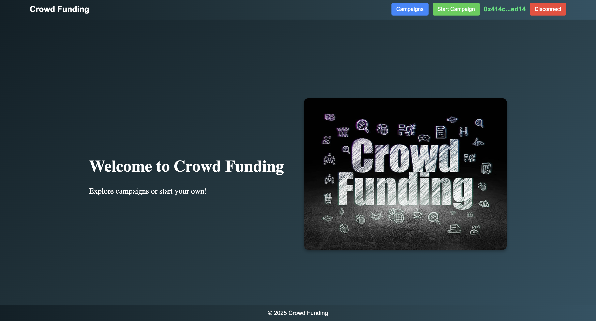
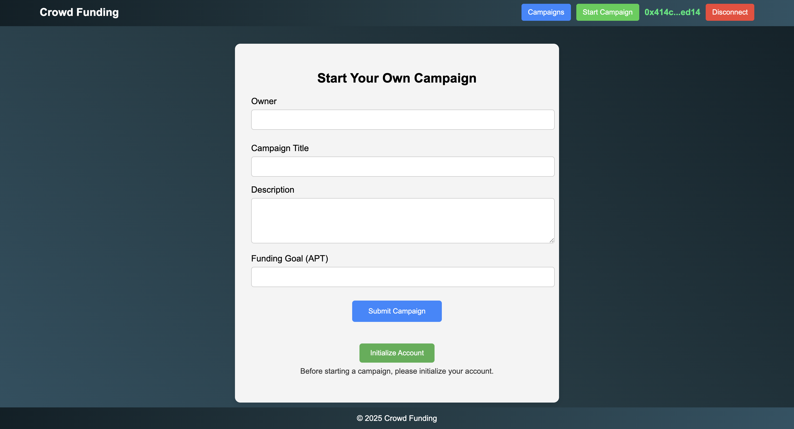

# 🌟 CrowdFunding DApp


---

## ⭐ Project Title
**CrowdFunding DApp** – A decentralized platform built on the Aptos blockchain for seamless and transparent campaign fundraising.

---

## ⭐ Project Description
CrowdFunding DApp allows users to create fundraising campaigns, contribute funds via Petra wallet, and view live campaign progress securely. Powered by smart contracts in Move and built with React for a responsive, modern UI.

---

## ⭐ Project Vision
Our goal is to **eliminate centralized control** in fundraising platforms and provide a **trustless, transparent, and global solution** for individuals and organizations seeking funding. With the power of blockchain, we ensure secure contributions and smart contract-based fund management.

---

## ⭐ Key Features

✅ Create Campaigns with Title, Description & Goal  
✅ Contribute in APT securely using Petra Wallet  
✅ Display Campaign Progress with Visual Bar  
✅ View & Delete Campaigns via Smart Contracts  
✅ Wallet Connection with Address Display  
✅ Mobile Responsive & Optimized UI  
✅ Clean UI with real-time refreshes  
✅ Integrated Move-based contract logic

---

## ⭐ Future Scope

🔄 Add Campaign Expiration & Refund Options  
📜 Contributor List with Contribution History  
📱 Release React Native Mobile App  
🌐 Multi-language & Accessibility Support  
📊 Campaign Analytics & Admin Dashboard  
🔐 Campaign Verification / Trust Scores  

---

## ⭐ Screenshot

| Campaign Page |  Campaign Details Page  |   Home Page      | Campaign Page      |
|---------------|------------------------|----------------|--------------------|
|  |  |  |  |

---

## 🚀 Tech Stack

- **Frontend**: React, TypeScript, CSS Modules  
- **Backend**: Aptos Blockchain (Move Language)  
- **Wallet**: Petra Wallet  
- **Deployment**: Vercel / Netlify (optional)  
- **Package Manager**: Yarn / NPM  

---


## 🌟 Project Features

- 🎯 Campaign creation with validation
- 🔐 Secure contributions with smart contracts
- 📈 Real-time campaign progress visualization
- 🧠 Decentralized logic using Move on Aptos
- 🔗 Petra Wallet integration
- 💻 Fully responsive and mobile-friendly interface
- 🧹 Automatic UI refresh on actions
- 🧩 Modular and clean React + TypeScript structure
- 🌐 Deploy-ready with basic CI support

---

## 🛠️ Setup Instructions

```bash
# 1. Clone the repository
git clone https://github.com/your-username/crowdfunding-dapp.git

# 2. Install dependencies
cd crowdfunding-dapp
npm install

# 3. Run the development server
npm run dev

---

## 🤝 Contributing

We welcome contributions from developers of all skill levels!  
To contribute:

1. Fork this repository.
2. Create a new branch (`git checkout -b feature/your-feature-name`).
3. Commit your changes (`git commit -am 'Add new feature'`).
4. Push to the branch (`git push origin feature/your-feature-name`).
5. Create a new Pull Request.

Help us make this DApp even better!

---

## 📄 License

This project is licensed under the [MIT License](LICENSE).

---

## ❤️ Acknowledgements

Thanks to the Aptos & Move community, Petra Wallet developers, and all open-source contributors for making this project possible.