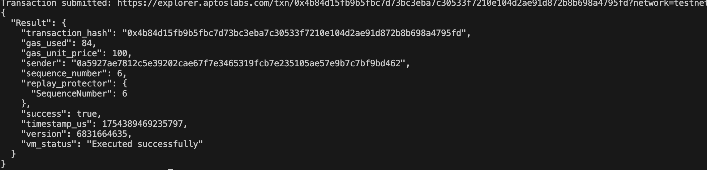
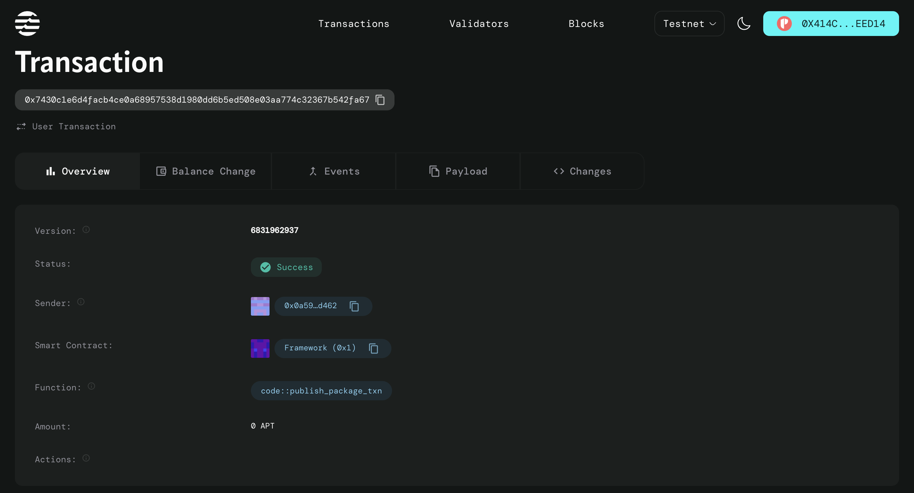

# 🌟 CrowdFunding DApp


A fully decentralized crowdfunding platform built on the Aptos blockchain using Move language and React for the frontend. It enables users to create campaigns, contribute funds, and track fundraising progress with complete transparency and trustlessness.

---

## 📌 Table of Contents

- [Project Description](#-project-description)
- [Features](#-features)
- [Project Vision](#-project-vision)
- [Future Scope](#-future-scope)
- [Screenshots](#-screenshots)
- [Tech Stack](#-tech-stack)
- [Getting Started](#-getting-started)
- [Transaction Hash](#-transaction-hash)
- [Contributing](#-contributing)
- [License](#-license)
- [Acknowledgements](#-acknowledgements)
- [Author](#-author)

---

## 📖 Project Description

CrowdFunding DApp allows users to:

- Launch personalized fundraising campaigns
- Accept secure contributions through Petra Wallet
- Track live progress of each campaign
- Eliminate centralized intermediaries in fundraising
- Ensure trust and transparency using blockchain technology

---

## ✨ Features

✅ Create and Delete Campaigns  
✅ Title, Description, Goal Input  
✅ Fund in APT via Petra Wallet  
✅ Smart Contract Integration with Move  
✅ View Campaign Details  
✅ Real-time Progress Tracking  
✅ Responsive UI with React  
✅ Integrated Wallet Connection  
✅ Refresh After Transaction  
✅ Admin-less and Fully Decentralized  

---

## 🚀 Project Vision

> To revolutionize fundraising by building a secure, permissionless, and transparent platform powered by blockchain technology.

We aim to eliminate third-party control, enable global access, and provide verifiable fundraising mechanisms for anyone, anywhere.

---

## 🔮 Future Scope

- ⌛ Campaign Expiry and Auto Refunds
- 🧾 Contributor Lists and History
- 📱 Native Mobile App (React Native)
- 🌍 Multi-language & Accessibility Support
- 📈 Admin Dashboard for Campaign Analytics
- 🛡️ Verified Campaign Trust Scores

---

## 🖼️ Screenshots

| Campaign Page | Campaign Details Page | Home Page | Start Campaign Page | Deploy Details |
|---------------|------------------------|-----------|----------------------|----------------|
|  |  |  |  |  |

---

## 🧰 Tech Stack

- **Frontend**: React, TypeScript, CSS Modules
- **Smart Contracts**: Move Language (Aptos)
- **Wallet**: Petra Wallet Integration
- **Deployment**: Vercel / Netlify (optional)
- **Package Manager**: Yarn / NPM

---

## 🛠 Getting Started

```bash
# Clone the repository
git clone https://github.com/your-username/crowdfunding-dapp.git
cd crowdfunding-dapp

# Install dependencies
npm install

# Run the development server
npm run dev
```

---

## 📦 Transaction Hash

```
0x7430c1e6d4facb4ce0a68957538d1980dd6b5ed508e03aa774c32367b542fa67
```



You can verify the deployed contract on the Aptos Explorer using the above transaction hash.

---

## 🤝 Contributing

We welcome all contributions!

1. Fork this repository 🍴
2. Create a new branch (`git checkout -b feature/your-feature`)
3. Commit your changes (`git commit -am 'Add some feature'`)
4. Push to the branch (`git push origin feature/your-feature`)
5. Open a Pull Request 📢

---

## 📄 License

This project is licensed under the MIT License - see the [LICENSE](LICENSE) file for details.

---

## 🙏 Acknowledgements

- Aptos Blockchain & Move Language  
- Petra Wallet Team  
- Open Source Community  
- Move Stdlib Contributors  

---

## 👤 Author

**Paul Jonathan Kakani**  
LinkedIn: [@PaulJonathanKakani](https://www.linkedin.com/in/paul-jonathan-kakani-74985023a)